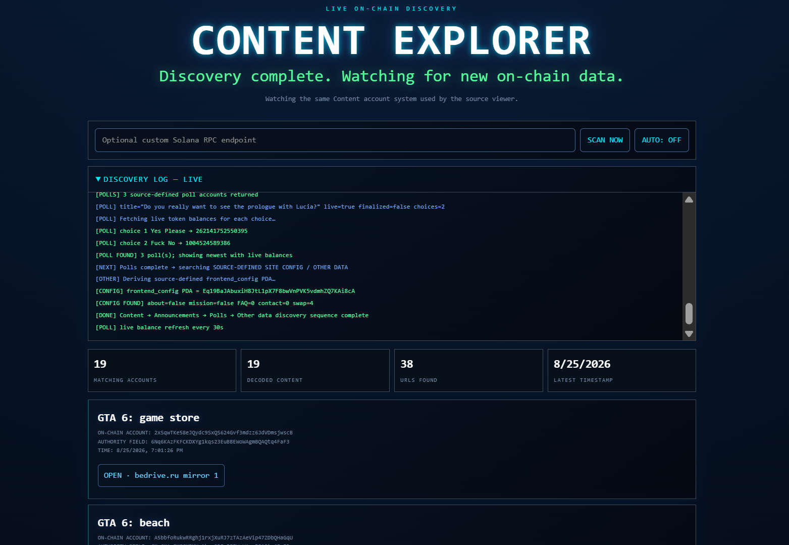
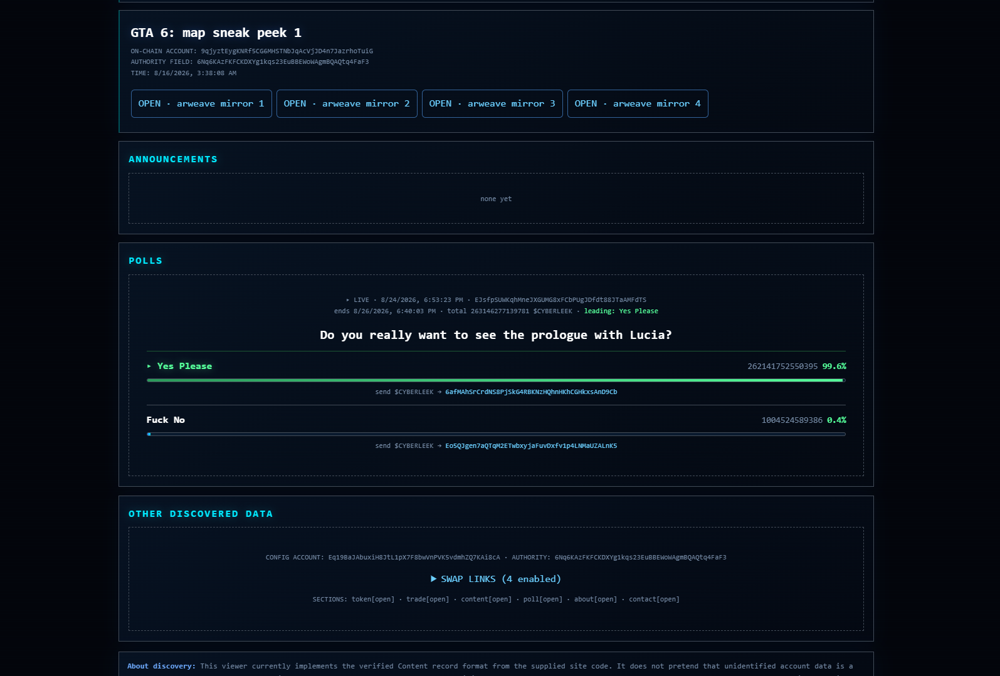

# CONTENT EXPLORER // FAN VIEWER
Live on-chain discovery tool for Solana. It watches the same Content account system used by the source viewer and surfaces the latest immersive content, announcements, polls, and site config straight from the chain — no scraping.
**Program:** `7rAgHPLDc9NryZmNdeEzyDui6D9PHkvTxMjKhNSa7w3a`

---
## What it does
Opens a cyberpunk-style fan viewer that:
1. Scans Solana for **Content** accounts (title + links / magnets)
2. Pulls **Announcements**
3. Loads **Polls** with live `$CYBERLEEK` vote balances
4. Reads the official **frontend_config** PDA (about, mission, FAQ, contacts, swap links, section visibility)
5. Shows everything in a live discovery log so you can see every RPC call and decode step
Built as a pure client-side page. No backend. Data comes only from Solana account data.
---
## How discovery works
### Content records
- Filter: discriminator `G6JNBZ2BSey` + exact size `7156` bytes
- Uses `getProgramAccounts` across multiple public RPCs
- Decodes: authority, timestamp, title, list of `{label, url}` (or single string fallback)
- Only keeps valid `http:`, `https:`, and `magnet:` links
- Sorts newest first and renders each as a card with OPEN / MAGNET buttons
### Announcements
- Discriminator `NjkxTouaByo`, size `656`
- Decodes: authority, timestamp, title, body
- Shows the 3 newest; older ones collapse under a details toggle
### Polls
- Discriminator `5Qpj1hsHT4k`, size `2800`
- Decodes: authority, timestamp, pollId, title, choices, endsAt, isFinalized, optional finalBalances
- For live polls it derives each choice’s vote ATA (option PDA + Token Program + mint) and fetches `getTokenAccountBalance`
- Displays percentage bars, leading choice, total `$CYBERLEEK`, and the ATA address to send votes to
- Auto-refreshes poll balances every 30 seconds
### Other / Site config
- Derives the PDA with seed `frontend_config`
- Decodes: about, mission, FAQ pairs, contact links, enabled swap links, section visibility/order, and secure_contact fields
- Renders contact buttons, FAQ accordion, and swap links when present
---
## Live discovery log
The log panel (open by default) prints every step in real time:
| Tag | Meaning |
|-----|---------|
| `[START]` / `[TARGET]` / `[FILTER]` | Scan kickoff and exact filters used |
| `[RPC]` / `[RPC OK]` / `[RPC FAIL]` | Each endpoint tried, account count, or timeout/error |
| `[CONTENT FOUND]` | Decoded title + URL count per account |
| `[ANNOUNCEMENTS]` / `[ANN FOUND]` | Announcement search results |
| `[POLL]` | Poll status, live/finalized, balance fetches per choice |
| `[CONFIG]` / `[CONFIG FOUND]` | frontend_config PDA and field counts |
| `[DONE]` | Full sequence finished |
Color coding: green = success, cyan = key step, yellow = warning, red = error.
You always see which RPC answered, how many accounts matched, and what the decoder produced. Nothing is hidden.
---
## Controls
- **Optional custom Solana RPC** — paste any endpoint; it is tried first, then public fallbacks
- **SCAN NOW** — full rescan of Content → Announcements → Polls → Config
- **AUTO: OFF / ON** — when on, full scan every 60 s (poll balances still refresh every 30 s even if auto is off)
Default public RPCs tried in order:
- `https://api.mainnet-beta.solana.com`
- `https://solana-rpc.publicnode.com`
- `https://solana.api.onfinality.io/public`
- `https://public.rpc.solanavibestation.com`
Each call has an 8-second timeout; failures move to the next endpoint automatically.
---
## Stats panel
Four live counters update after every scan:
- Matching accounts (raw program accounts returned)
- Decoded Content records
- Valid URLs / magnets found
- Latest content timestamp
---
## Tech notes
- Pure browser: `@solana/web3.js` loaded from esm.sh only when needed for PDA derivation
- Account data is base64 → binary → custom little-endian `Reader` (u8, u32, i64, strings, vecs, pubkeys)
- Content decoder tries a multi-item list first; falls back to a single string field if the layout differs
- Poll vote ATAs are derived on the fly from pollId + choice index so balances stay accurate without trusting stored numbers (unless the poll is finalized and finalBalances exist)
- HTML is escaped before render to keep the page safe with on-chain strings
- Unknown or undecodable accounts are ignored; only verified discriminators and sizes are used
---
## Why this exists
The official viewer already shows content. This fan page makes the same on-chain records transparent: you see the exact RPC calls, the decode path, live poll voting with `$CYBERLEEK`, announcements, and the site’s own config account. Everything is open and readable so anyone can watch new drops the moment they land on Solana.
Created by just a fan — not the author.
